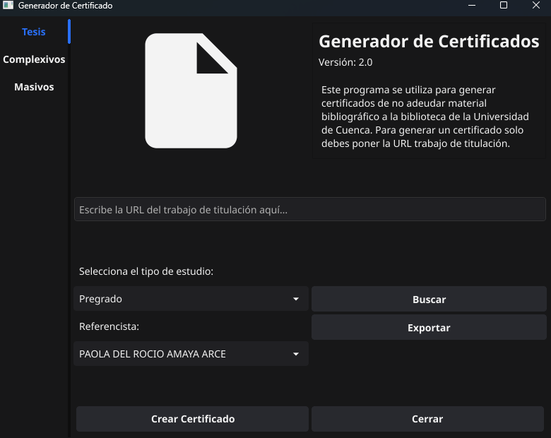

# Generador de Certificados

Este proyecto es una aplicación de escritorio desarrollada en Go utilizando el framework [Fyne](https://fyne.io/). La aplicación permite generar certificados de no adeudar material bibliográfico para estudiantes de la Universidad de Cuenca.



## Características

- **Generación de certificados individuales**: Permite generar un certificado para un estudiante ingresando su información manualmente.
- **Generación de certificados masivos**: Permite cargar un archivo CSV con información de varios estudiantes y generar certificados para todos ellos.
- **Exportación de datos**: Exporta registros de certificados generados a un archivo CSV.
- **Búsqueda de certificados**: Busca certificados en la base de datos local.
- **Interfaz amigable**: Diseñada con el framework Fyne para una experiencia de usuario intuitiva.

## Requisitos

- **Go**: Versión 1.20 o superior.
- **Dependencias**:
  - Biblioteca `fyne` para la interfaz gráfica:
    ```bash
    go get fyne.io/fyne/v2
    ```
  - Biblioteca `unioffice` para trabajar con documentos Word:
    ```bash
    go get github.com/unidoc/unioffice
    ```

## Instalación

1. Clona este repositorio:
   ```bash
   git clone https://github.com/tu-usuario/generador-certificados.git
   cd generador-certificados
   ```

2. Instala las dependencias:
   ```bash
   go mod tidy
   ```

3. Ejecuta la aplicación:
   ```bash
   go run main.go
   ```

## Uso

### Generación de Certificados Individuales

1. Ve a la pestaña **Tesis**.
2. Ingresa la URL del trabajo de titulación.
3. Selecciona el tipo de estudio (Pregrado o Posgrado).
4. Selecciona el referencista.
5. Haz clic en **Crear Certificado**.

### Generación de Certificados Masivos

1. Ve a la pestaña **Masivos**.
2. Selecciona un archivo CSV con la información de los estudiantes.
3. Selecciona la facultad y la carrera.
4. Haz clic en **Crear Certificados Masivos**.

### Exportación de Datos

1. Ve a la pestaña **Exportar por Fecha**.
2. Ingresa una fecha en el formato `YYYY`, `YYYY-MM` o `YYYY-MM-DD`.
3. Haz clic en **Exportar**.

### Búsqueda de Certificados

1. Ve a la pestaña **Buscar Certificado**.
2. Ingresa el identificador del certificado (handle).
3. Haz clic en **Buscar**.

## Formato del Archivo CSV

El archivo CSV debe tener el siguiente formato:

```csv
Nombre,Facultad,Carrera
Juan Pérez,Facultad de Ingeniería,Computación
María López,Facultad de Ciencias Sociales,Sociología
Pedro Gómez,Facultad de Medicina,Medicina
```

## Estructura del Proyecto

```
generador-certificados/
├── database/                # Módulo para manejar la base de datos
├── scraping/                # Módulo para extraer datos
├── word/                    # Módulo para generar documentos Word
├── main.go                  # Archivo principal de la aplicación
├── go.mod                   # Archivo de dependencias
├── go.sum                   # Suma de comprobación de dependencias
├── generador-imagen.png     # Captura de pantalla del generador
└── README.md                # Documentación del proyecto
```

## Contribuciones

¡Las contribuciones son bienvenidas! Si encuentras un problema o tienes una idea para mejorar el proyecto, abre un issue o envía un pull request.

## Licencia

Este proyecto está bajo la Licencia MIT. Consulta el archivo `LICENSE` para más detalles.

## Contacto

Si tienes preguntas o necesitas ayuda, puedes contactarme en [tu-email@ejemplo.com](mailto:tu-email@ejemplo.com).